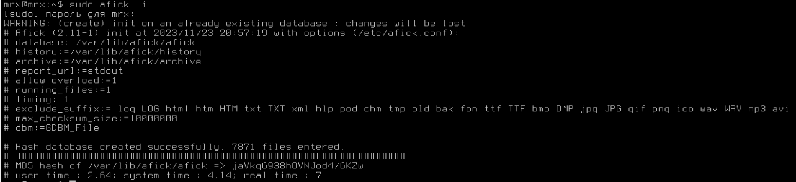

# Pz-4.2

# Практическое задание "Контроль целостности"
## Подготовленная виртуальная машина с Astra linux
Для выполнения данного задания был скачан образ Astra Linux и установлена версия системы "Смоленск" с максимальным уровнем защиты  

## Настройка и проверка мандатного контроля целостности
Для измнения конфигурации МКЦ в ОС Astra Linux необходимо воспользоваться утилитой Управление политикой безопасности  

В меню Режим эксперта можно непосредственно назначить уровни целостности для директорий. В качестве проверки правила NWU я обозначил 2 тестовые директории с такими правами:  

Для проверки мандатного контроля необходимо зайти в учетную запись с атрибутом целостности уровня "Низкий". 
Ниже представлен пример взаимодействия по записи между обеими папками  

Здесь можно увидеть, что копирование файла с атрибутом ниже в папку с атрибутом выше не сработало - была получена ошибка доступа. В то же время "запись вниз" работает.
## Работа с режимом замкнутой программной среды
Для проверки работы режима ЗПС в Управлении политикой безопасности необходимо включить данные настройки:  

В качестве тестового файла я взял скрипт для установки VMWare Tools. Результат выполнения на скриншоте:  

## Работа с утилитами контроля целостности и регламентного контроля целостности
### Использование `gostsum`
Утилита `gostsum` вычисляет хэш-сумму файлов в соответствии с ГОСТ Р 34.11-2012. Пример использования с .deb пакетом:  

### Использование `afick`
`afick` - утилита, предназначенная для контроля целостности файловой системы ОС. Для корректной работы утилиты сначала создается БД утилиты:  

Далее изменим часть системных файлов для получения ответа от утилиты, перед этим сделав бэкап:  

Получаем результат от утилиты:  

